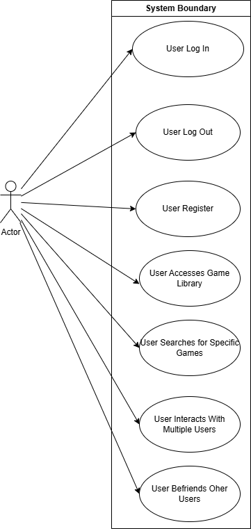
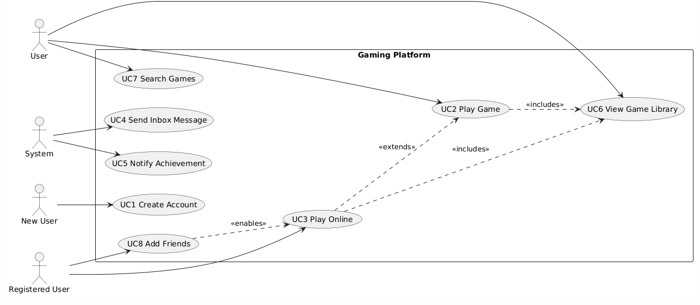

# Unified Features and Use Case Catalog (Merged for Assignment 5)

## Features (Combined Across All Members)

### Logan’s Features
- Log In  
- Log Out  
- Register  
- Game Library  
- Search  
- User Interactions  

### Alex’s Features
- Register  
- Maintain WebSocket Connections  
- Online Activities  
- Inbox Messages  
- Game Library  
- Search  
- Friends  
- Achievement System  
- Toast Notifications  

### Eli’s Features
- User Blocking and Safety Controls  
- User Reporting System  
- Support Ticket System  
- Game Progress Tracking  
- Notification Preferences Management  
- Role and Permission Management  
- Account Recovery  
- Privacy and Visibility Settings  

---

# Unified Brief Use Cases (Renumbered UC1–UC25)

# Unified Brief Use Cases (Renumbered UC1–UC25 with Actors & Goals)

### UC1 – User Logs In  
- **Primary Actor:** User  
- **Goal:** User successfully logs into the site using valid credentials.

### UC2 – User Logs Out  
- **Primary Actor:** User  
- **Goal:** User successfully logs out of the site.

### UC3 – User Registers  
- **Primary Actor:** User  
- **Goal:** User creates a new account using registration credentials.

### UC4 – User Accesses Game Library  
- **Primary Actor:** User  
- **Goal:** User views the catalog of available games.

### UC5 – User Searches for Specific Games  
- **Primary Actor:** User  
- **Goal:** User searches for a specific game within the site.

### UC6 – User Interacts One‑on‑One  
- **Primary Actor:** User  
- **Goal:** User opens a one‑on‑one communication channel with another user.

### UC7 – User Interacts with Multiple Users  
- **Primary Actor:** User  
- **Goal:** User opens a group chat with multiple users.

### UC8 – User Befriends Other Users  
- **Primary Actor:** User  
- **Goal:** User establishes a friendship relationship with one or more users.

---

### UC9 – User Creates an Account  
- **Primary Actor:** New User  
- **Goal:** User successfully creates and registers an account.

### UC10 – User Plays a Game  
- **Primary Actor:** User  
- **Goal:** User opens and plays an available game.

### UC11 – User Plays Online  
- **Primary Actor:** Registered User  
- **Goal:** User connects to online services and plays an online game.

### UC12 – System Sends Inbox Letter  
- **Primary Actor:** System  
- **Goal:** System delivers a message to the user’s inbox.

### UC13 – System Alerts User of Achievement  
- **Primary Actor:** System  
- **Goal:** System notifies the user when they complete an achievement.

### UC14 – User Views Game Library  
- **Primary Actor:** User  
- **Goal:** User receives the site’s library of games.

### UC15 – User Searches for a Game/Genre  
- **Primary Actor:** User  
- **Goal:** User receives search results for a game, genre, or related query.

### UC16 – User Becomes Friends with Another User  
- **Primary Actor:** Registered User  
- **Goal:** User becomes friends with another user and can interact socially.

---

### UC17 – User Blocks Another User  
- **Primary Actor:** User  
- **Goal:** User prevents another user from messaging, friending, or interacting with them.

### UC18 – User Reports Another User  
- **Primary Actor:** User  
- **Goal:** User submits a report about inappropriate behavior or content.

### UC19 – User Submits a Support Ticket  
- **Primary Actor:** User  
- **Goal:** User creates a support request for technical, account, or safety issues.

### UC20 – User Views Game Progress  
- **Primary Actor:** User  
- **Goal:** User views their saved progress for a specific game.

### UC21 – User Updates Notification Preferences  
- **Primary Actor:** User  
- **Goal:** User customizes which notifications they receive.

### UC22 – Admin Assigns User Roles  
- **Primary Actor:** Admin  
- **Goal:** Admin grants or modifies user roles such as moderator or developer.

### UC23 – Admin Moderates User Reports  
- **Primary Actor:** Admin  
- **Goal:** Admin reviews submitted reports and takes appropriate action.

### UC24 – User Recovers Account  
- **Primary Actor:** User  
- **Goal:** User regains access to their account after losing credentials.

### UC25 – User Adjusts Privacy Settings  
- **Primary Actor:** User  
- **Goal:** User controls who can view their profile, activity, and online status.

# Unified Use Case Traceability Table

| Use Case | Feature(s) |
|---------|-------------|
| UC1 | Log In, Register, User Interactions |
| UC2 | Log In, Register, Log Out |
| UC3 | Log In, Register, Log Out, User Interactions |
| UC4 | Game Library, Search |
| UC5 | Search, Game Library |
| UC6 | Log In, Register, User Interactions |
| UC7 | Log In, Register, User Interactions |
| UC8 | Log In, Register, User Interactions |
| UC9 | Register |
| UC10 | Game Library, WebSocket Connections |
| UC11 | Register, Online Activities, Game Library, WebSocket Connections |
| UC12 | Register, Inbox Messages |
| UC13 | Register, Achievement System, Toast Notifications |
| UC14 | Game Library |
| UC15 | Game Library, Search |
| UC16 | Register, Online Activities, Friends |
| UC17 | User Blocking and Safety Controls |
| UC18 | User Reporting System |
| UC19 | Support Ticket System |
| UC20 | Game Progress Tracking |
| UC21 | Notification Preferences Management |
| UC22 | Role and Permission Management |
| UC23 | User Reporting System, Role and Permission Management |
| UC24 | Account Recovery |
| UC25 | Privacy and Visibility Settings |

## Use Case Diagram

### Logan's Diagram

### Alex's Diagram

### Eli's Diagram

## Detailed Use Cases

# Logan

### UC1: User Logs In
- **Primary Actor:** User
- **Goal:**  A user logs into the site.
- **Preconditions:**  The user is not currently logged in; The user has already registered on the site.
- **Success Outcome:**  The user enters their username, password, and clicks log in and is redirected to a page that cofirms they want to sign in as their username and they click Yes, sign in and are redirected to the sites homepage as a logged in user.

** Main Flow **
1. User opens browser and enters  the URl of the site.
2. User navigates to a menu item that requires a log in.
3. User clicks log in and puts in their credentials.

** Alternate Flow **
* A1: User opens browser and enters the url of the site.
* A2: The User navigates to another menu item that requires log in.
* A3: User clicks log in and enters credentials.

### UC2: User Logs Out
**Primary Actor:** User
**Goal:**  A user logs out of the site
**Preconditions:**  The user is currently logged in; The user has already registered on the site.
**Success Outcome:**  The user successfully logs out of their account and are redirected back to the home page.

** Main Flow ** 
1. User navigates to the menu and hits the log out button.
2. System confirms the user tries logging out
3. System logs user out.

** Alternate Flow ** 
* A1:
* A2:

### UC3 – User Registers  
- **Primary Actor:** User  
- **Goal:** User creates a new account using registration credentials.

### UC4 – User Accesses Game Library  
- **Primary Actor:** User  
- **Goal:** User views the catalog of available games.

### UC5 – User Searches for Specific Games  
- **Primary Actor:** User  
- **Goal:** User searches for a specific game within the site.

### UC6 – User Interacts One‑on‑One  
- **Primary Actor:** User  
- **Goal:** User opens a one‑on‑one communication channel with another user.

### UC7 – User Interacts with Multiple Users  
- **Primary Actor:** User  
- **Goal:** User opens a group chat with multiple users.

### UC8 – User Befriends Other Users  
- **Primary Actor:** User  
- **Goal:** User establishes a friendship relationship with one or more users.

---
# Alex

### UC9 – User Creates an Account  
- **Primary Actor:** New User  
- **Goal:** User successfully creates and registers an account.
- **Preconditions:** User should not be signed into an account
- **Success Outcome:** A new account is created 

### UC10 – User Plays a Game  
- **Primary Actor:** User  
- **Goal:** User opens and plays an available game.

### UC11 – User Plays Online  
- **Primary Actor:** Registered User  
- **Goal:** User connects to online services and plays an online game.

### UC12 – System Sends Inbox Letter  
- **Primary Actor:** System  
- **Goal:** System delivers a message to the user’s inbox.

### UC13 – System Alerts User of Achievement  
- **Primary Actor:** System  
- **Goal:** System notifies the user when they complete an achievement.

### UC14 – User Views Game Library  
- **Primary Actor:** User  
- **Goal:** User receives the site’s library of games.

### UC15 – User Searches for a Game/Genre  
- **Primary Actor:** User  
- **Goal:** User receives search results for a game, genre, or related query.

### UC16 – User Becomes Friends with Another User  
- **Primary Actor:** Registered User  
- **Goal:** User becomes friends with another user and can interact socially.

---
# Eli

### UC17 – User Blocks Another User  
- **Primary Actor:** User  
- **Goal:** User prevents another user from messaging, friending, or interacting with them.
- **Preconditions:** User is authenticated; Target user exists in system; The user has not already blocked the target user
- **Success Outcome:** Target user is added tothe user's block list and future interactions are prevented

** Main Flow **
1. User indicates intent to block another user
2. System verifies the target user exists
3. System verifies the user has not already blocked the target user
4. System records the block relationship
5. System updates the interaction rules to prevent further communication
6. System confirms the block.

** Alternate FFlow **
A1. Target user does not exist -> System rejects the requrest.
A2. User already blocked target -> System rejects the request.

### UC18 – User Reports Another User  
- **Primary Actor:** User  
- **Goal:** User submits a report about inappropriate behavior or content.
- **Preconditions:** User is authenticated; Target user exists; report contains valid details.
- **Success Outcome:** 

** Main Flow **

** Alternate Flow **

### UC19 – User Submits a Support Ticket  
- **Primary Actor:** User  
- **Goal:** User creates a support request for technical, account, or safety issues.
- **Preconditions:**
- **Success Outcome:**

** Main Flow **

** Alternate Flow **

### UC20 – User Views Game Progress  
- **Primary Actor:** User  
- **Goal:** User views their saved progress for a specific game.
- **Preconditions:**
- **Success Outcome:**

** Main Flow **

** Alternate Flow **

### UC21 – User Updates Notification Preferences  
- **Primary Actor:** User  
- **Goal:** User customizes which notifications they receive.
- **Preconditions:**
- **Success Outcome:**

** Main Flow **

** Alternate Flow **

### UC22 – Admin Assigns User Roles  
- **Primary Actor:** Admin  
- **Goal:** Admin grants or modifies user roles such as moderator or developer.
- **Preconditions:**
- **Success Outcome:**

** Main Flow **

** Alternate Flow **

### UC23 – Admin Moderates User Reports  
- **Primary Actor:** Admin  
- **Goal:** Admin reviews submitted reports and takes appropriate action.
- **Preconditions:**
- **Success Outcome:**

** Main Flow **

** Alternate Flow **

### UC24 – User Recovers Account  
- **Primary Actor:** User  
- **Goal:** User regains access to their account after losing credentials.
- **Preconditions:**
- **Success Outcome:**

** Main Flow **

** Alternate Flow **

### UC25 – User Adjusts Privacy Settings  
- **Primary Actor:** User  
- **Goal:** User controls who can view their profile, activity, and online status.
- **Preconditions:**
- **Success Outcome:**

** Main Flow **

** Alternate Flow **

