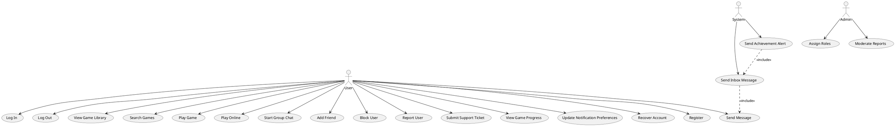

# Logan

## Features
- Log In 
# Consolidated Features and Use Cases

## Features (consolidated)
- Register / Account management
- Log In / Log Out / Account Recovery
- Game Library / Play Game / Game Progress Tracking
- Search (games, genres)
- Friends / Friend requests
- One-on-one messaging / Inbox messages
- Group chat / Multi-user interactions
- Maintain WebSocket / Online activities
- Achievements & Toast notifications
- Notification preferences
- User blocking / Reporting / Safety controls
- Support ticket system
- Role & permission management (admin)
- Privacy & visibility settings

## Consolidated Brief Use Cases

### UC1: User registers an account
- Primary Actor: New user
- Goal: Create and register an account.

### UC2: User logs in
- Primary Actor: Registered user
- Goal: Authenticate and access site features.

### UC3: User logs out
- Primary Actor: Registered user
- Goal: End session securely.

### UC4: User accesses or plays a game
- Primary Actor: User
- Goal: Browse the game library and play a selected game (local or online).

### UC5: User searches for games or genres
- Primary Actor: User
- Goal: Find games via search filters/queries.

### UC6: User interacts with another user (1:1)
- Primary Actor: User
- Goal: Send/receive messages and inbox items.

### UC7: User opens or participates in a group chat
- Primary Actor: User
- Goal: Chat with multiple users simultaneously.

### UC8: User manages friendships
- Primary Actor: Registered user
- Goal: Send/accept friend requests and manage friend list.

### UC9: System sends notifications / achievements
- Primary Actor: System
- Goal: Deliver inbox messages, achievement alerts, and toast notifications.

### UC10: User blocks or reports another user
- Primary Actor: User
- Goal: Prevent interaction and submit reports for moderation.

### UC11: User submits a support ticket
- Primary Actor: User
- Goal: Request help for technical or account issues.

### UC12: Admin assigns roles / moderates reports
- Primary Actor: Admin
- Goal: Manage roles and respond to user reports.

### UC13: User recovers account / manages privacy & notifications
- Primary Actor: User
- Goal: Recover lost credentials and adjust privacy/notification preferences.

## Use Case Traceability

| Use Case | Feature(s) |
|---|---|
| UC1: User registers an account | Register / Account management |
| UC2: User logs in | Log In, Register |
| UC3: User logs out | Log Out |
| UC4: User accesses or plays a game | Game Library, Play Game, WS connections |
| UC5: User searches for games or genres | Search, Game Library |
| UC6: User interacts with another user (1:1) | One-on-one messaging, Inbox messages, Friends |
| UC7: User opens or participates in a group chat | Group chat, WS connections |
| UC8: User manages friendships | Friends, User Interactions |
| UC9: System sends notifications / achievements | Inbox messages, Achievement system, Toast notifications |
| UC10: User blocks or reports another user | User Blocking and Safety Controls, User Reporting System |
| UC11: User submits a support ticket | Support Ticket System |
| UC12: Admin assigns roles / moderates reports | Role & Permission Management, User Reporting System |
| UC13: User recovers account / manages privacy & notifications | Account Recovery, Privacy & Visibility Settings, Notification Preferences |

## Unified Use Case Diagram (PlantUML)

The following PlantUML block represents the consolidated actors and use cases; you can paste it into a PlantUML renderer to generate an image.

---

If you'd like, I can: export the PlantUML as a PNG, render and embed the image here, or adjust grouping/labels in the diagram. 
| UC8: User Recovers Account | Account Recovery |
| UC9: User Adjusts Privacy Settings | Privacy and Visibility Settings |

## Use Case Diagram

I made this in paint(the one built into windows) because of how artistic I am

