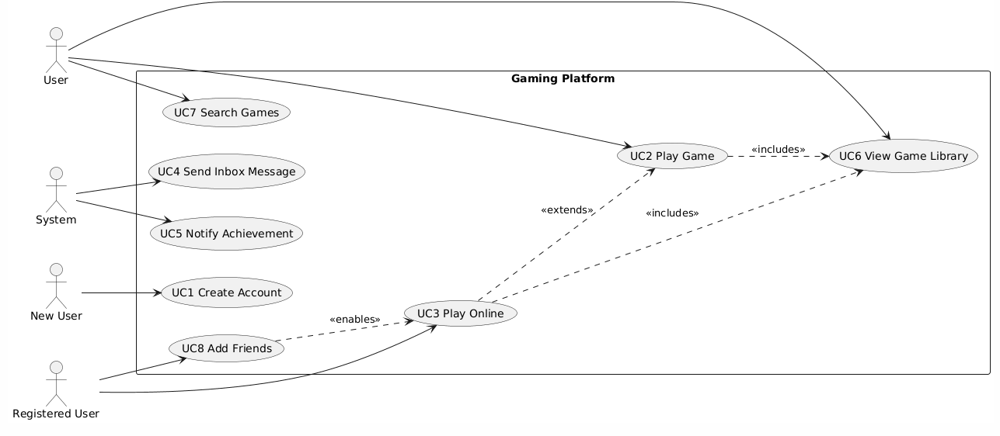

# Features and Use Cases

## Features
- Register
- Maintain WS connections
- Online Activities
- Inbox Messages
- Game Library
- Search
- Friends
- Achievement system
- Toast Notifications

...

## Brief Use Cases

### UC1: User creates an account
- Primary Actor: New user
- Goal: User successfully creates and registers his account.    

### UC2: User plays a game
- Primary Actor: User
- Goal: User opens an available game and plays.

### UC3: User plays online
- Primary Actor: Registered User
- Goal: User connects to online services and plays online game.

### UC4: System sends an inbox letter to user
- Primary Actor: System
- Goal: System sends a letter to the user's inbox

### UC5: System alerts user of achievement
- Primary Actor: System
- Goal: System alerts user when he has completed an achievement.

### UC6: User views the Game Library
- Primary Actor: User
- Goal: User receives the site's library of games

### UC7: User searches for a specific game, genera, etc.
- Primary Actor: User
- Goal: User receives the results of his search

### UC8: User becomes friends with another user
- Primary Actor: Registered User
- Goal: The registered user becomes friends with another user and can chat and play online together.

...

## Use Case Traceability

| Use Case | Feature(s) |
|---|---|
| UC1: User creates an account | Register |
| UC2: User plays a game | Game Library, WS connections |
| UC3: User plays online | Register, Online Activities, Game Library, WS connections |
| UC4: System sends an inbox letter to user | Register, Inbox Messages |
| UC5: System alerts user of achievement | Register, Achievement system, Toast Notifications |
| UC6: User views the Game Library | Game Library |
| UC7: User searches for a specific game, genera, etc. | Game Library, Search |
| UC6: User becomes friends with another user | Register, Online Activities, Friends |
...

## Use Case Diagram
Here is my diagram built with PlantUML (AI assisted, so it might not look the greatest)

