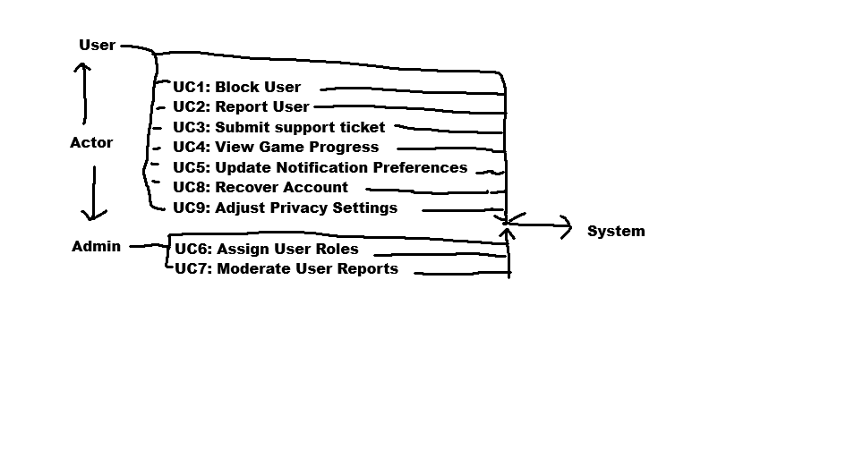

## Features
- User Blocking and Safety Controls
- User Reporting System
- Support Ticket System
- Game Progress Tracking
- Notification Preferences Management
- Role and Permission Management
- Account Recovery
- Privacy and Visibility Settings

## Brief Use Cases

### UC1: User Blocks Another User
- Primary Actor: User
- Goal: User prevents another user from sending messages, friend requests, or interacting with them.

### UC2: User Reports Another User
- Primary Actor: User
- Goal: User submits a report about inappropriate behavior or content.

### UC3: User Submits a Support Ticket
- Primary Actor: User
- Goal: User creates a support request for technical issues, account problems, or abuse concerns.

### UC4: User Views Game Progress
- Primary Actor: User
- Goal: User views their saved progress for a specific game.

### UC5: User Updates Notification Preferences
- Primary Actor: User
- Goal: User customizes which notifications they receive (friend requests, achievements, messages, etc.).

### UC6: Admin Assigns User Roles
- Primary Actor: Admin
- Goal: Admin grants or modifies user roles such as moderator or developer.

### UC7: Admin Moderates User Reports
- Primary Actor: Admin
- Goal: Admin reviews submitted reports and takes appropriate action.

### UC8: User Recovers Account
- Primary Actor: User
- Goal: User regains access to their account after losing credentials.

### UC9: User Adjusts Privacy Settings
- Primary Actor: User
- Goal: User controls who can view their profile, activity, and online status.

## Use Case Traceability

| Use Case | Feature(s) |
|---|---|
| UC1: User Blocks Another User | User Blocking and Safety Controls |
| UC2: User Reports Another User | User Reporting System |
| UC3: User Submits a Support Ticket | Support Ticket System |
| UC4: User Views Game Progress | Game Progress Tracking |
| UC5: User Updates Notification Preferences | Notification Preferences Management |
| UC6: Admin Assigns User Roles | Role and Permission Management |
| UC7: Admin Moderates User Reports | User Reporting System, Role and Permission Management |
| UC8: User Recovers Account | Account Recovery |
| UC9: User Adjusts Privacy Settings | Privacy and Visibility Settings |

## Use Case Diagram

I made this in paint(the one built into windows) because of how artistic I am

